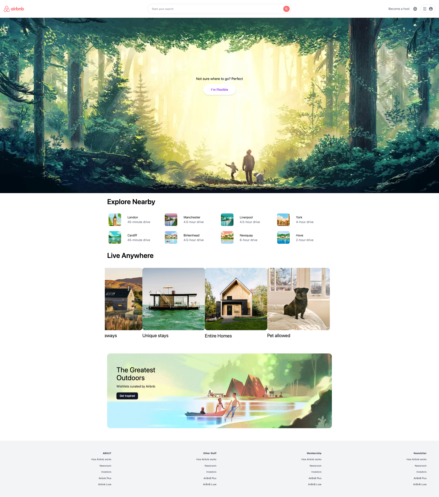
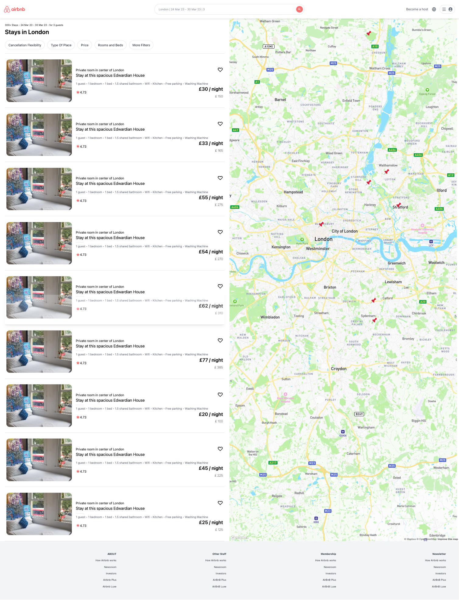
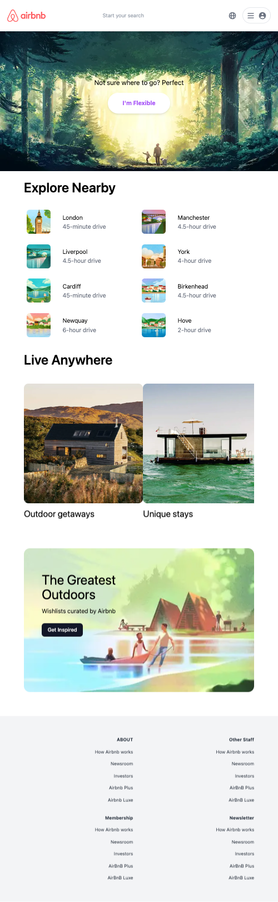
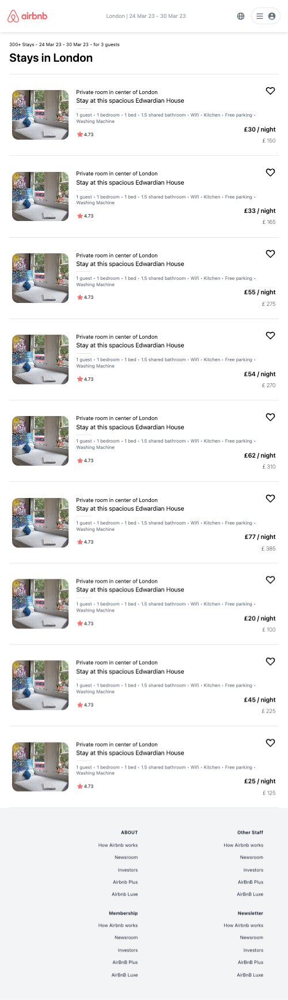

# Airbnb Clone

This is a solution with improvements to the [Let's build Airbnb 2.0 with NEXT.JS! (ReactJS, Tailwind CSS, Mapbox, Calendar & Date Picker) from Sonny Sangha](https://www.youtube.com/watch?v=b8gBIphfCqw).

## Table of contents

-   [Overview](#overview)
    -   [The challenge](#the-challenge)
-   [My process](#my-process)
    -   [Built with](#built-with)
    -   [What I learned](#what-i-learned)
-   [Preview](#preview)
    -   [Links](#links)
    -   [Screenshot](#screenshot)
-   [Author](#author)

## Overview

### The challenge

Users should be able to:

-   View the optimal layout for the site depending on their device's screen size
-   See hover states for all interactive elements on the page
-   Integrate Map library
-   Integrate Calendar library
-   Server side rendering
-   Loading bar on top

Extras I have Included:

-   Scroll when hover on corner of Live Anywhere cards
-   Remember Date and Guest selections on calendar after search

## My process

### Built with

-   Semantic HTML5 markup
-   CSS custom properties
-   Flexbox
-   CSS Grid
-   Mobile-first workflow
-   [tailwindcss](https://tailwindcss.com/) - CSS Framework

### What I learned

This is my first project using tailwindcss. I learned more about it. Couple bullet points below:

-   tailwindcss website searchbox helps a lot
-   Using @apply in css level clears out html significantly. Also allows quick changes to multiple components that uses same classes. Such as nav-links and cards
-   config file is very powerful to define custom colors and dimensions
-   Dark mode and remembering user preferences for next session
-   Sticky navbar

## Preview

### Links

-   Repo URL: [Solution](https://github.com/enszrlu/airbnb-clone)
-   Live Site URL: [Live Site](https://airbnb-clone-nine-puce.vercel.app/)

### Screenshot

## Author

-   Website - [github](https://github.com/enszrlu)
